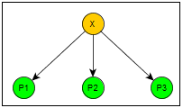
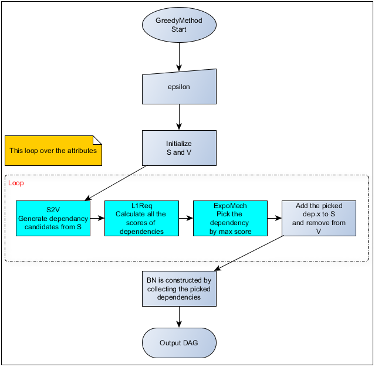

# GreedyBayes

## Perpose
Generating the Bayesian Network(BN) from data.

## Terminologies
1. **Dependency**: The attribute-parents pair(AP-Pair), for example: 
    
    Where $$P_{i}$$ are the parent nodes with number no more then the degree of Bayesian network $$k$$.

## Main Process

1. epsilon: the **privacy budget**
1. Initialize S and V: 
    * **S**: initially consists of a index of a random picked attributes.
    * **V**: consists of the indexes of all attributes